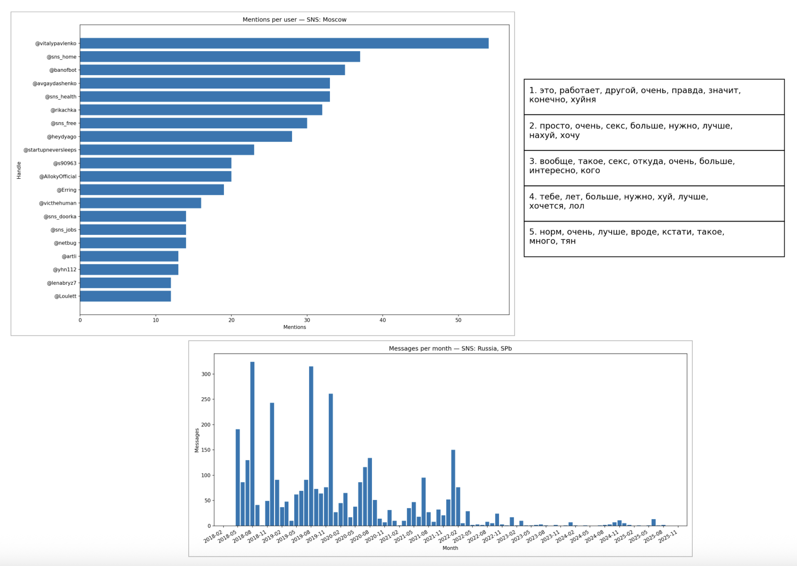

# 📊 Telegram Chat Analyzer

Analyze Telegram chat exports and generate interactive statistics and visualisations — all locally, right in your
browser.

  


---

## 📚 Table of Contents

- [Features](#-features)
- [Installation](#-installation)
- [Exporting Data from Telegram](#-exporting-data-from-telegram)
- [Configuration](#-configuration)
- [Usage](#-usage)
- [Example Visualisations](#-example-visualisations)
- [Custom Visualisations](#-custom-visualisations)
- [Project Structure](#-project-structure)
- [Contributing](#-contributing)
- [License](#-license)
- [Author](#-author)

---

## ✨ Features

- 📈 **Charts & Graphs** — message activity, top users, word clouds, emoji usage, and more.
- 🗂 **Multiple Chat Formats** — supports Telegram JSON export.
- ⚡ **Local Processing** — no server required, data stays on your machine.
- 🔌 **Extensible** — easily add new metrics by creating custom processors.

---

## 📦 Installation

```
git clone https://github.com/username/telegram-chat-analyzer.git
cd telegram-chat-analyzer
```

### 🐳 Docker Support (Alternative)

If you prefer to run the application in a container, you can use Docker Compose:

1. Ensure you have Docker and Docker Compose installed on your system
2. Place your Telegram JSON export files in the `data/` directory
3. Run the application with Docker Compose:
   ```bash
   docker-compose up
   ```

The results will be available in the `results/` directory, just like with the regular installation.

---

## 📥 Exporting Data from Telegram

[See detailed instructions](docs/how_to_extract_data/how_to_extract_data.md)

---

## ⚙️ Configuration

[Configuration file](config.yaml)

---

## 🚀 Usage

Run the analyzer:

```
make run
```

Output will be saved in the `result/` folder.  
Open `index.html` in your browser to view the interactive dashboard.


### 🐳 Docker Usage

To run with Docker Compose:

```bash
# Place your Telegram JSON export files in the `data/` directory
# Then run:
docker-compose up

# Or run in detached mode:
docker-compose up -d
```

To stop the containers:
```bash
docker-compose down
```

To rebuild the containers (after making changes to the code):
```bash
docker-compose up --build
```

You can customize the Docker Compose setup by creating a `docker-compose.override.yml` file based on the provided example.

To run the analyzer with custom configuration in Docker:
```bash
# Create your custom config file
# Then run with custom config:
docker-compose run --rm tg-chat-analyzer python main.py your-custom-config.yaml
```

#### Web Server for Results (Optional)

The project includes a Caddyfile for serving the results via a web server. To use it:

1. Uncomment the `web` service section in `docker-compose.yml` or add it to your `docker-compose.override.yml`
2. Run `docker-compose up`
3. Access the results at http://localhost:8000

---

## 🔗 Live Demo

You can explore an **interactive version of the analysis** online:  
👉 [https://artur-in.me/chat-analysis/sns](https://artur-in.me/chat-analysis/sns)

---

## 📊 Example Visualisations

The project already includes the following chart types:

| Chart                                 | Link                                                                                                |
|---------------------------------------|-----------------------------------------------------------------------------------------------------|
| Active Users per Month                | [More](docs/graphics_info/active_users_per_month/active_users_per_month.md)                         |
| First Time Posters Over Time          | [More](docs/graphics_info/first_time_posters_over_time/first_time_posters_over_time.md)             |
| Join/Leave Events per Month           | [More](docs/graphics_info/join_leave_events_per_month/join_leave_events_per_month.md)               |
| Mentions per User                     | [More](docs/graphics_info/mentions_per_user/mentions_per_user.md)                                   |
| Top Users by Message Count            | [More](docs/graphics_info/top_users_by_messages_from_id/top_users_by_messages_from_id.md)           |
| Average Message Length per Month      | [More](docs/graphics_info/average_message_length_per_month/average_message_length_per_month.md)     |
| Hashtags per Month                    | [More](docs/graphics_info/hashtags_per_month/hashtags_per_month.md)                                 |
| Messages by Weekday                   | [More](docs/graphics_info/messages_by_weekday/messages_by_weekday.md)                               |
| Messages per Hour                     | [More](docs/graphics_info/messages_per_hour/messages_per_hour.md)                                   |
| Messages per Month                    | [More](docs/graphics_info/messages_per_month/messages_per_month.md)                                 |
| Pinned Messages per Month             | [More](docs/graphics_info/pinned_messages_per_month/pinned_messages_per_month.md)                   |
| Ratio: Service vs. Messages Over Time | [More](docs/graphics_info/ratio_service_vs_message_over_time/ratio_service_vs_message_over_time.md) |
| Topics NMF                            | [More](docs/graphics_info/topics_nmf/topics_nmf.md)                                                 |
| Wordcloud Top Words                   | [More](docs/graphics_info/wordcloud_top_words/wordcloud_top_words.md)                               |

---

## Custom Visualisations

[How to add your own chart](docs/custom_visualisation/custom_visualisation.md)

---

## 📂 Project Structure

```
telegram-chat-analyzer/
│
├── processors/                    # Data processing scripts
├── templates/                    # HTML templates for visualisation
├── docs/                         # Screenshots and documentation
├── output/                       # .json Telegram chat data exported files
├── data/                         # Generated charts and dashboards
├── main.py                       # Entry point
├── requirements.txt              # Python dependencies
├── config.yaml                   # Configurations and settings
├── Dockerfile                    # Docker configuration
├── docker-compose.yml            # Docker Compose configuration
├── docker-compose.override.yml.example  # Docker Compose override example
├── Caddyfile                     # Web server configuration (optional)
├── LICENSE                       # License file
└── README.md                     # This file
```

---

## 🤝 Contributing

Contributions are welcome!  
If you want to add new processors or improve documentation:

1. Fork the repository
2. Create a new branch (`feature/my-feature`)
3. Commit changes
4. Submit a Pull Request

---

## 📜 License

This project is licensed under the [MIT License](LICENSE).

---

## 👤 Author

**Your Name**

- GitHub: [@artur-gavronchuk](https://github.com/artur-gavronchuk)
- Telegram: [@it_is_artur](https://t.me/it_is_artur)
- Website: [artur-in.me](https://artur-in.me/)  
